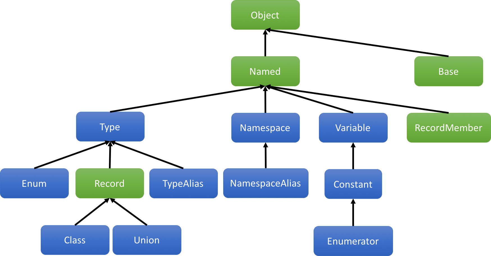

---
title: constexpr reflexpr
subtitle: |
  - Document number: **P0953R0**, ISO/IEC JTC1 SC22 WG21
  - Date: 2017-02-11
  - Authors: Matúš Chochlík <chochlik@gmail.com>, Axel Naumann <axel@cern.ch>,
    and David Sankel <dsankel@bloomberg.net>
  - Audience: SG7 Reflection

  ## Contents
...

## Abstract

<table>
<tr>
<td>
**Before**
</td>
<td>
**After**
</td>
</tr>
<tr>
<td>
```c++
template <typename T>
T min(const T& a, const T& b) {
  using MetaT = reflexpr(T);
  log() << "min<"
        << get_display_name_v<MetaT>
        << ">(" << a << ", " << b << ") = ";
  T result = a < b ? a : b;
  log() << result << std::endl;
  return result;
}
```
</td>
<td>
```c++
template <typename T>
T min(const T& a, const T& b) {
  constexpr reflect::Type const * metaT = reflexpr(T);
  log() << "min<"
        << metaT->get_display_name()
        << ">(" << a << ", " << b << ") = ";
  T result = a < b ? a : b;
  log() << result << std::endl;
  return result;
}
```
</td>
</tr>
</table>

The reflexpr series of papers ([P0385](http://wg21.link/p0385),
[P0194](http://wg21.link/p0194), [P0578](http://wg21.link/p0578), and most
recently [P0670](http://wg21.link/p0670)) provide facilities for static
reflection that are based on the template metaprogramming paradigm. Recently,
however, language features have been proposed that would enable a more
natural syntax for metaprogramming through use of `constexpr` facilities
(See: [P0598](http://wg21.link/p0598), [P0633](http://wg21.link/p0633),
[P0712](http://wg21.link/p0712), and [P0784](http://wg21.link/p0784)). This
paper explores the impact of these language facilities on reflexpr and
considers what a natural-syntax-based reflection library would look like.

## Introduction

### From TMP-reflexpr to CXP-reflexpr

Template-metaprogramming-based reflexpr (TMP-reflexpr), which is succinctly
described in [P0578](http://wg21.link/p0578),  includes a `reflexpr` operator
that, when applied to C++ syntax, produces a *type* that encodes "meta"
information about that syntax. For example, when `reflexpr` is applied to a
type, the result can be used to query that type's name and, in the case of a
class, list its member variables.

Consider the following implementation of a function `dump` which outputs the
name and public data members of an arbitrary type. Note that iteration of the
data members involves use of an auxiliary function and variadic templates.

```c++
template <typename T>
void dumpDataMembers(); // implemented below

template <typename T>
void dump()
    // Output the name and data members of a record (class, struct, union).
    // For example:
    //..
    // struct S {
    //     std::string m_s;
    //     int m_i;
    // };
    // 
    // int main {
    //     dump<S>(); // name: S
    //                // members:
    //                //   std::string m_s
    //                //   int m_i
    // }
    //..

{
    using MetaT = reflexpr(T);
    std::cout << "name: " << get_display_name_v<MetaT> << std::endl;
    std::cout << "members:" << std::endl;

    using DataMemberObjectSequence = get_public_data_members_t<MetaT>;
    dumpDataMembers<unpack_sequence<std::tuple, DataMemberObjectSequence>>();
}

template <>
void dumpDataMembers<std::tuple<>>() { }
    // base case does nothing

template <typename DataMember, typename... DataMembers>
void dumpDataMembers<std::tuple<DataMember, DataMembers...>>()
{
    // Output information about the first data member and recurse for the
    // subsequent data members.
    std::cout
        << "  " << get_display_name_v<get_type_t<DataMember>>
        << " " << get_display_name_v<DataMember>
        << std::endl;
    dumpDataMembers<std::tuple<DataMembers...>>();
}
```

While the above code can be simplified somewhat by use of a template
metaprogramming library such as Boost.MPL, this snippet is fairly
representative of the complexity and, for most C++ developers,
unfamiliarity of the required constructs.

Louis Dionne's Boost.Hana library provides an alternative approach whereby
values with specially designed types allow one to write code that has much of
the appearance of normal C++ code, but actually accomplishes metaprogramming
(See [P0425](http://wg21.link/p0425)).  Instead of having to write a separate
function to accomplish iteration, one could use `hana::for_each` from within
the `dump` function.

```c++
hana::for_each(metaT.get_public_data_members(), [&](auto dataMember) {
    std::cout
        << "  " << dataMember.getType().get_display_name()
        << " " << dataMember.get_display_name()
        << std::endl;
});
```

While this mitigates much of the syntactic complexity of template
metaprogramming, the types involved are opaque (they cannot be named) and
special library features are required to accomplish tasks such as iteration.

Constexpr-based reflexpr (CXP-reflexpr), the subject of this paper, operates in
the Hana-style: instead of `reflexpr` producing a *type*, it produces a
*value* that encodes meta information. Unlike Hana-style, however, this value
has a non-opaque type and we normally do not need special library features to
work with it.

The following snippet illustrates our original example using CXP-reflexper.

```c++
template <typename T>
void dump() {
    constexpr reflect::Record const * metaT = reflexpr(T);
    std::cout << "name: " << metaT->get_display_name() << std::endl;
    std::cout << "members:" << std::endl;
    for(RecordMember const * member : metaT->get_public_data_members())
        std::cout
            << "  " << member->get_type()->get_display_name()
            << " " << member->get_name() << std::endl;
}
```

### Mix compile-time reflection with runtime values

In the above example, we didn't have a need to mix a runtime value with
compile-time meta-information. While this is doable with TMP-reflexpr,
additional language facilities are required to accomplish this with
CXP-reflexpr.

Consider a function `dumpJson` that outputs an arbitrary `class` or `struct` as
a JSON string. Note the use of two new language constructs: `constexpr for`,
and `unreflexpr`.

```c++
void dumpJson(const std::string &s);
    // Output 's' with double-quotes and escaped special characters.

void dumpJson(const int &i);
    // Output 'i' as an int.

template <typename T>
void dumpJson(const T &t) {
    std::cout << "{ ";
    constexpr reflect::Class const * metaT = reflexpr(T);
    bool saw_prev = false;
    constexpr for(RecordMember const * member : metaT->get_public_data_members())
    {
        if(saw_prev) {
            std::cout << ", ";
        }

        std::cout << member->get_name() << "=";

        constexpr reflect::Constant const * pointerToMember = member->get_pointer();
        dumpJson(t.*unreflexpr(pointerToMember));

        saw_prev = true;
    }
    std::cout << " }";
}

struct S {
    std::string m_s;
    int m_i;
};

int main {
    dumpJson( S{"hello", 33} ); // outputs: { m_s="hello", m_i=33 }
}
```

The recursive call warrants some additional explanation

```c++
dumpJson(t.*unreflexpr(pointerToMember));
```

* `pointerToMember` is "meta" information about a pointer to a member. In the
  above example, it refers to `&S::m_s` in the first iteration of the loop and
  `&S::m_i` in the second iteration.
* The `unreflexpr` operator converts this "meta" information about the pointer
  to member to the pointer to member itself.
* `t.*` is the syntax for accessing a pointer to member.
* `dumpJson` is the recursive call.

The first iteration is decomposed like this:

```c++
dumpJson(t.*unreflexpr(pointerToMember));
              ↓
dumpJson(t.*&S::m_s);
              ↓
dumpJson(t.m_s);
```

The second iteration is similar:

```c++
dumpJson(t.*unreflexpr(pointerToMember));
              ↓
dumpJson(t.*&S::m_i);
              ↓
dumpJson(t.m_i);
```

## Supporting language constructs

### `constexpr for`

This construct essentially unrolls a for loop at compile-time, allowing for the
body of the loop to manifest different types at different iterations. This was
originally proposed by Andrew Sutton in [P0589](http://wg21.link/p0589) for
Hana-style programming, but the unrolling semantics work for our purposes as
well.

While this language construct isn't strictly necessary for CXP-reflexper, we
think it greatly simplifies code that would otherwise require complex library
facilities.

### constexpr-time allocators

constexpr-time allocators as described in [P0784](http://wg21.link/p0784) (also
seen in a more preliminary form in [P0597](http://wg21.link/p0784)) allow us to
make use of `std::vector`, among other data types, at compile time. While these
constructs aren't strictly necessary (resizable arrays based on fixed buffer
sizes has been demonstrated by Ben Deane and Jason Turner in
[P0810](http://wg21.link/p0810)), they make the data structures used at compile
time more uniform with those at runtime.

### `unreflexpr`

With TMP-reflexpr, types are easily extracted because we are already in a type
context.

```c++
// 'foo' has a type that is the same as the first field of 'S'.
get_reflected_type_t<
  get_type_t<
    get_element_t<
        0,
        get_public_data_members_t<reflexpr(S)>>>> foo;
```

With CXP-reflexpr, on the other hand, once we have a `Type` object, there isn't
a language facility for going back into type processing

```c++
constexpr Type const * t = reflexpr(S)->get_public_data_members()[0]->get_type();

// unreflexpr is required to create 'foo' with the type that 't' refers to.
unreflexpr(t) foo;
```

Therefore, the one language-level feature that is critical for feature parity
with TMP-reflexpr is `unreflexpr` support. It is required for both types and
compile-time values.

## Library considerations

A `constexpr reflexpr` facility has several library-level implications and
design questions. These are addressed in this section.

### Typeful reflection

Some of the initial sketches for constexpr-based reflection had the `reflexpr`
operation produce values that are always of the same type. While this has some
advantages for implementers and is certainly simpler that each value having its
own unique type, we feel that making some use of types will encourage
programming that is easier to read and reason about.

* Typeful reflection enables the use of overloading in library development.
  Consider the simplicity of the following overloaded function when compared to
  a single function implemented with `constexpr if`.

    ```c++
    void outputMetaInformation(reflect::Union const *);
    void outputMetaInformation(reflect::Class const *);
    void outputMetaInformation(reflect::Enum const *);
    void outputMetaInformation(reflect::Type const *);
    void outputMetaInformation(reflect::TypeAlias const *);
    void outputMetaInformation(reflect::Namespace const *);
    void outputMetaInformation(reflect::NamespaceAlias const *);
    void outputMetaInformation(reflect::RecordMember const *);
    void outputMetaInformation(reflect::Variable const *);
    void outputMetaInformation(reflect::Enumerator const *);
    ```
* Typeful reflection is similar to the already accepted and sufficiently
  motivated concepts-based TMP reflexpr. Types to values is what's concepts are
  to types.

* Using untyped reflection has many of the same problem as treating all memory
  as `void*`. Reasonably-strong types help with organization and the long-term
  maintenance of programs.

We also considered using `std::variant` or variant-like classes as an
alternative to reference semantics. Due to the complexity of visitation, the
resulting code ended up complex looking, especially for those newer to the
language. If a language-level variant with pattern matching support were to be
incorporated into C++, then this might be worth revisiting.

### Downcasting

While reflecting syntax will produce the most-specific type available, the need
to go from a general type to a specific type remains. For example, the return
type of `Record::get_public_member_types` is `std::vector<Type const*>`. A user
may want to "downcast" one of these types into a `Class`, for example.

For this, we provide two cast-related operations in our `Object` class:

```c++
class Object {
public:
    // ...

    template<typename T>
    constexpr T const * get_as() const;
        // Return the specified view, but constexpr-throw (aka diagnose) in
        // case of invalid accesses.

    template<typename T>
    constexpr bool is_a() const;
        // Returns whether or not this object can be viewed as the specified
        // 'T'.
};
```

These functions allow a user to check if the object can be downcasted and to
actually perform the operation.

### type_traits

The C++ standard library includes several metafunctions that aid in
metaprogramming in the `<type_traits>` header.  `std::add_const_t` is one such
example. While these facilities can be used in the CXP-reflexpr paradigm, it is
awkward:

```c++
Type const * p = /*...*/;
Type const * constP = reflexpr(std::add_const_t<unreflexpr(p)>);
```

We propose that each of these existing metaprogramming functions get a
CXP-reflexpr-styled equivalent with a new `_r` suffix.

```c++
namespace std {
  constexpr reflect::Type const * add_const_r(reflect::Type const * t)
  {
    // Not necessarily implemented in this way.
    return reflexpr(std::add_const_t<unreflexpr(t)>);
  }
}
```

## Datatypes and Operations

CXP-reflexpr provides a rich class hierarchy representing the various
attributes that can be reflected. The following diagram illustrates this
hierarchy.

{#id .class width=100%}

Arrows go from derived classes to base classes. The blue classes are those that
`reflexpr` directly produces values of. The green classes are those that are
intermediate or indirectly available from the other classes.

### Classes

What follows is a short synopsis of the class hierarchy described above.

```c++
namespace reflect {

class Object {
public:
    constexpr std::source_location get_source_location() const;
    constexpr std::string get_source_file_name() const;

    template<typename T>
    constexpr T const * get_as() const;

    template<typename T>
    constexpr bool is_a() const;
};

class Named : public Object {
    constexpr bool is_anonymous() const;
    constexpr std::string get_name() const;
    constexpr std::string get_display_name() const;
};

class Type : public Named { };

class Record : public Type
{
public:
    constexpr std::vector<RecordMember const*> get_public_data_members() const;
    constexpr std::vector<RecordMember const*> get_accessible_data_members() const;
    constexpr std::vector<RecordMember const*> get_data_members() const;

    constexpr std::vector<Type const*> get_public_member_types() const;
    constexpr std::vector<Type const*> get_accessible_member_types() const;
    constexpr std::vector<Type const*> get_member_types() const;
};

class Union : public Record { };

class Class : public Record
{
public:
    constexpr bool is_struct() const;
    constexpr bool is_class() const;

    constexpr std::vector<Base const*> get_public_bases() const;
    constexpr std::vector<Base const*> get_accessible_bases() const;
    constexpr std::vector<Base const*> get_bases() const;

    constexpr bool is_final() const;
};

class Enum : public Type
{
    constexpr bool is_scoped_enum() const;
    constexpr std::vector<Enumerator const*> get_enumerators() const;
};

class TypeAlias : public Type
{
    constexpr Type const * get_aliased() const;
};

class Variable : public Named
{
    constexpr bool is_constexpr() const;
    constexpr bool is_static() const;

    constexpr Constant const * get_pointer() const; 
    constexpr Type const * get_type() const; 
};

class Base : public Object
{
    constexpr Class const * get_class() const;
    constexpr bool is_virtual() const;
    constexpr bool is_public() const;
    constexpr bool is_protected() const;
    constexpr bool is_private() const;
};

class Namespace : public Named
{
    constexpr bool is_global() const;
    constexpr bool is_inline() const;
};

class NamespaceAlias : public Namespace
{
    constexpr Namespace const * get_aliased() const;
};

class RecordMember : public Named
{
    constexpr bool is_public() const;
    constexpr bool is_protected() const;
    constexpr bool is_private() const;

    constexpr Record const * get_type() const;
};

class Constant : public Variable { };

class Enumerator : public Constant { };

} // namespace reflect
```

<!-- TBD: Enumerator can't implement the 'get_pointer' method of 'Variable' unfortunately. I think this should probably be fixed in the language rather than us working around it here. -->

### `reflexpr`

`reflexpr( texp )` returns values of types according to the first rule that
applies:

* If `texp` is a type alias, a `TypeAlias const *` is returned.
* If `texp` is an enum, a `Enum const *` is returned.
* If `texp` is a class, a `Class const *` is returned.
* If `texp` is a union, a `Union const *` is returned.
* If `texp` is any other type, a `Type const *` is returned.
* If `texp` is a namespace alias, a `NamespaceAlias const *` is returned.
* If `texp` is a namespace, a `Namespace const *` is returned.
* If `texp` is an enumerator, a `Enumerator const *` is returned.
* If `texp` is a compile-time constant, a `Constant const *` is returned.
* If `texp` is a variable, a `Variable const *` is returned.

### `unreflexpr`

`unreflexpr(meta)` produces the entities according to the following rules:

* If `meta` has type `Type const*`, the result is the type that `meta`
  reflects.
* If `meta` has type `Constant const*`, the result is the value that `meta`
  reflects.

## Conclusion

This paper introduces a facility that allows for compile-time reflection using
a natural, constexpr-styled programming by taking advantages of new constexpr
language features on the horizon. The result is a much simplified interface
that makes both reflection and metaprogramming more accessible and
maintainable.

## Acknowledgments

None of this would be possible without the continued, pioneering work of Daveed
Vandevoorde, Louis Dionne, and Andrew Sutton in improving the experience of
constexpr programming.
